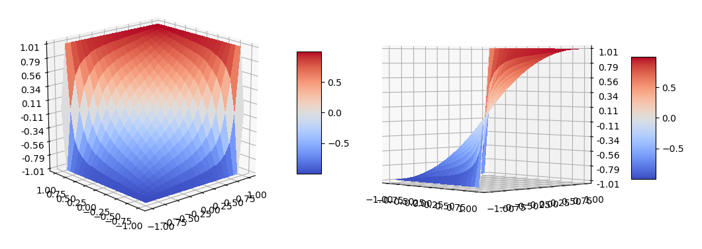

# Confidence function

Предположим, мы пишем парсер, который для каждого правила грамматики задаёт вероятность. Если данное правило распарсилось, то мы умножаем эту вероятность к итоговой.

В таком случае проблема классических вероятностей, - чисел от 0 до 1, в том, что для большого размера парсируемого текста итоговая вероятность будет очень маленькой. И нам сложно оценить насколько мы уверенны в данном результате.

Здесь же представлен тип данных `confidence`, умножение которых позволяет представлять такую уверенность. У этого типа данных есть три разных состояния:
* Степень уверенности в том что гипотеза неверна
* Полная неуверенность
* Степень уверенности в том гипотеза верна

Его область определения `A = [-1, 1]`:
* На области `[-1, 0)` отображается уверенность в том что это неправильно. Чем ближе к `-1`, тем больше эта уверенность
* Элемент `0` означает что неизвестно правильно это или нет
* На области `(0, 1]` отображается уверенность в том что это правильно. Чем ближе к `1`, тем больше эта уверенность

Переопределён метод для умножения этих "уверенностей" друг на друга. Обозначим его как `P(a: A, b: A) -> A`, то есть функция принимает два аргумента из области определения `A`, и возвращает результат из этой же области определения. Эта функция обладает следующими свойствами:
* `P(x, 0) = x`
* `P(x, -1) = -1`
* `P(x, 1) = 1`
* `P(x, +y) >= x` - положительные увеличивают
* `P(x, -y) <= x` - отрицательные уменьшают
* `P(P(x, y), z) = P(P(x, z), y)` - независимо от порядка применения получается один и тот же результат. Это очень важно, потому что при парсинге возможно много вариантов в какой последовательности применить функцию, и от этого очень много зависит.
* `P(x, y)` относительно `y` монотонно возрастает.
* `P(x, y) = P(y, x)` - это свойство не нужно было для парсинга, но оно случайно появилось

Все эти свойства проверяются как в тестах, так обычными умножениями, так и взятием интегралов.

Так же существует особое состояние, отображающее полную бессмыслицу. Оно возникает при умножении уверенности `-1` на `1`. Оно аналогично `NaN`, но представляется более явно через `Option::None`. Умножение чего угодно на это значение даёт в итоге это значение. Некоторые свойства из-за этого не полностью выполняются на всей области определения.

Примеры:
```
P(0, 0.2) = 0.2
P(0, -0.2) = -0.2
P(0.2, -0.1) = 0.1111
P(0.1111, -0.5) = -0.4375
P(-0.4375, 0.3) = -0.1964
P(-0.1964, 0.5) = 0.3777
```

Далее, чтобы преобразовать эту уверенность в вероятность, можно просто прибавить `1` и разделить на `2`. Это будет означать вероятность что гипотеза истинна.
* `0 -> 0.5` - неуверенность стала шансом `50` на `50`, логично
* `1 -> 1` - уверенность на `100%` стала вероятностью на `1`
* `-1 -> 0` - уверенность в том что это неверно стала вероятностью `0`

Здесь имеется специальный тип данных "вероятность", к которому можно преобразовать "уверенность". В обратную сторону это запрещено делать, потому что умножение вероятностей это не то же самое что умножение "уверенностей". 

# Изображение

Вот так выглядит функция `P`. Это же можно посмотреть вручную, запустив `example/draw`, для него требуется `nightly` компилятор.



# TODO

- [ ] Написать на английском
- [ ] Написать более подробно
- [ ] Документация
- [ ] Перевести на дженерики, чтобы работало для любого вещественного числа
- [x] Default конструктор